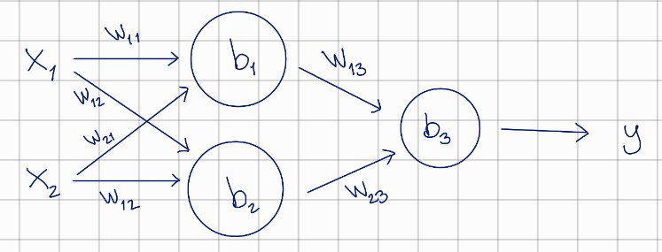

# Who needs PyTorch?
## Simple machine learning algorithms built in Python, using only numpy and matplotlib.

The purpose of this project is to build small machine learning algorithms, to get to the fundamentals of ML.
As such, nothing is optimally implemented and there is no fancy back-propagation.

The algorithms are intended to model basic logic gates, like AND, OR and XOR.

---------------

### Single neuron model (single_neuron.py)

Logic gates like AND have two inputs and a single output. This is reflected in the model such that the single neuron
takes two inputs and returns a single output, so the architecture looks something like the image below.

Training the model, the cost vs. iteration curves look like power laws, which is reasonable.

The algorithm is able to model gates like AND and OR, for which I've plotted 3D below.
The x and y axes correspond to the inputs of the gates, and z axis to the output. The black
markers are the training data, and the surface is the model output.

Looks decent, but as can be seen from the image below, XOR gate does not work. Why not?

Taking another look at the architecture, the equation we are essentially solving for is:
output = activation(weight1\*input1 + weight2*input2 + bias). The activation function brings some non-linearity,
but the surface still does not have any saddle points -- meaning, it can't look like a pringle. To solve this issue, we
need more parameters, so let's pump them up from 3 to 9.

### Three neuron model (three_neurons.py)

Adding a few more neurons, the architecture now looks something like this:

Training this model, we get much better results for the XOR gate. We can see that with the
newely introduced degrees of freedom allow for this pringle shape, and the XOR gate is able to be modelled.

That's it. I recommend you read through the code comments as well.

